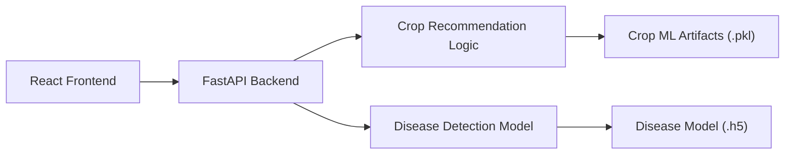

# Nile Crop

Nile Crop is a smart agriculture project that combines a modern frontend, a FastAPI backend, and AI-powered crop and disease analysis in one repository.

## Overview

This repository is organized as a single project with two main parts:

- `nile-crop/`: frontend application
- `smart-crop-backend/`: backend API and AI logic

## Team Members

Supervisor:

- Dr. Eman Salah Salem Ahmed

Team Leader:

- Ashraf Mohamed El Sayed - ID: 4241391

Project Team:

- Mostafa Hamdy Ahmed - ID: 4241362
- Rofaida Islam Elsayed - ID: 4241635
- Ahmed Elsaed Mostafa - ID: 4241309
- Fares Ahmed Adel - ID: 4241131
- Lina Mohamed Sayed - ID: 4241289
- Sama Abdalla Elsaied - ID: 4241527
- Mohamed Adel Elbaz - ID: 4241120
- Abdalla adel Mohamed - ID: 4241032

## Screenshots

- Home interface: main landing page with crop recommendation and disease detection access
- Crop recommendation result: shows the top suggested crops based on the selected city
- Disease detection result: shows the uploaded leaf image, detected disease, confidence, and treatment guidance

## Features

- Crop recommendation based on city and agricultural conditions
- Plant disease detection from uploaded leaf images
- Arabic-first user interface
- Fast API-based backend for frontend integration
- AI/ML models for crop and disease prediction

## Tech Stack

### Frontend

- React
- Vite
- JavaScript
- CSS
- Axios
- i18next

### Backend

- FastAPI
- Python
- TensorFlow
- scikit-learn
- SQLAlchemy

## Project Structure

```text
NileCrop
├── nile-crop/
│   ├── src/
│   ├── public/
│   └── package.json
├── smart-crop-backend/
│   ├── routers/
│   ├── services/
│   ├── models/
│   ├── disease_models/
│   ├── ml_models/
│   └── requirements.txt
└── README.md
```

## Architecture



## How To Run

### 1. Clone the repository

```bash
git clone https://github.com/mostafaa22h/NileCrop.git
cd NileCrop
```

### 2. Run the backend

```powershell
cd smart-crop-backend
python -m venv venv
.\venv\Scripts\activate
pip install -r requirements.txt
python -m uvicorn main:app --host 127.0.0.1 --port 8000
```

### 3. Run the frontend

Open a second terminal:

```powershell
cd nile-crop
npm install
npm run dev -- --host 127.0.0.1 --port 5173
```

### 4. Open the app

Visit:

- Frontend: `http://127.0.0.1:5173`
- Backend: `http://127.0.0.1:8000`

## Security And Repository Notes

- `.env` files are not tracked
- No API keys or secret tokens were found in the uploaded repository
- `node_modules` is not tracked
- `venv` is not tracked
- temporary cache folders are not tracked

## Models

The current ML model files are already small enough to stay inside the repository:

- `disease_model.h5`: about `9.35 MB`
- `crop_model.pkl`: about `2.79 MB`

Important:

- `.pkl` and `.h5` files are trained model artifacts, not source code files
- the source code that loads and uses them is inside:
  - `smart-crop-backend/services/recommendation_engine.py`
  - `smart-crop-backend/services/disease_engine.py`
  - `smart-crop-backend/routers/recommend.py`
  - `smart-crop-backend/routers/upload.py`

## AI Training Note

This submission contains the deployed inference assets and backend integration needed to run the project.

Some earlier internal AI iteration files such as model training/export utilities were developed separately in previous project versions. The current repository focuses on the runnable academic submission version:

- frontend
- backend
- trained model artifacts
- inference and API integration

If model sizes grow later, use one of these options:

- Git LFS
- Google Drive link
- cloud storage download step during setup

## Release

Current release tag:

- `v1.0`
